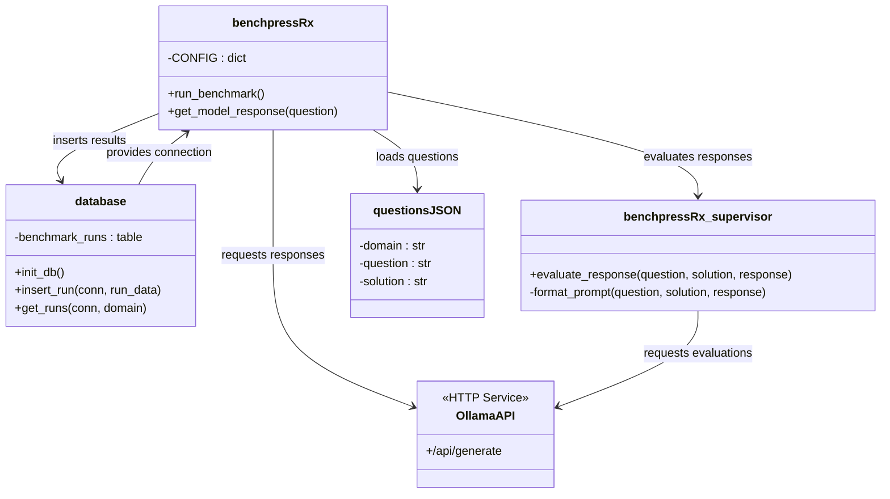
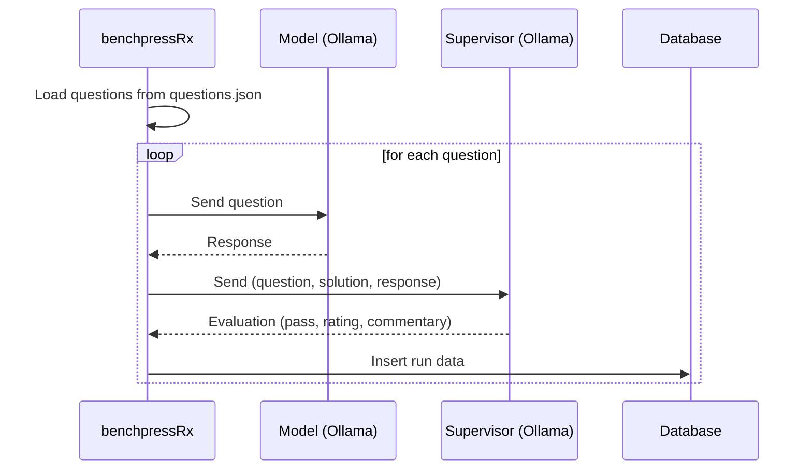

<h1>benchpressRx</h1>
  

    <b>LLM Supervised LLM Benchmark</b>
  

---

## PROTOTYPING / WORK IN PROGRESS (⚠️)

This software is a work in progress and currently in its prototyping phase. It is not intended for production use. Errors may occur, features may change, and documentation may be fragmented or incomplete. During the prototyping phase, all support inquiries about this software will be ignored.

## DATABASE SCHEMA

The application uses a SQLite database with the following schema:

### benchmark_runs Table
| Column Name | Type | Constraints | Description |
|-------------|------|-------------|-------------|
| id | INTEGER | PRIMARY KEY AUTOINCREMENT | Unique identifier |
| test_domain | TEXT | NOT NULL | Domain/category of the test |
| test_question | TEXT | NOT NULL | The question/input given to the model |
| test_solution | TEXT | NOT NULL | Expected correct solution |
| unit_response | TEXT |  | Model's response |
| supervisor_instruction | TEXT |  | Supervisor's instruction to the model |
| supervisor_commentary | TEXT |  | Supervisor's analysis/feedback |
| supervisor_pass | BOOLEAN |  | Whether the response passed evaluation |
| supervisor_rating | REAL |  | Numeric rating of the response |
| timestamp | DATETIME | DEFAULT CURRENT_TIMESTAMP | When the test was recorded |

## ARCHITECTURE DIAGRAM

## INFORMATION FLOW DIAGRAM

## COPYRIGHT CONTEXT & LICENSE

Copyright 2025 - Robin Winkelmann | robinRx | rx-inference

This repository, its software and all other associated material is licensed under Apache License, Version 2.0 (the "License").
You may not use this file except in compliance with the License.
See the [LICENSE](https://github.com/rx-inference/benchpressRx/blob/main/LICENSE) in the root of this project for details.
You may obtain a copy of the License at http://www.apache.org/licenses/LICENSE-2.0.

Unless required by applicable law or agreed to in writing, software
distributed under the License is distributed on an "AS IS" BASIS,
WITHOUT WARRANTIES OR CONDITIONS OF ANY KIND, either express or implied.
See the License for the specific language governing permissions and
limitations under the License.